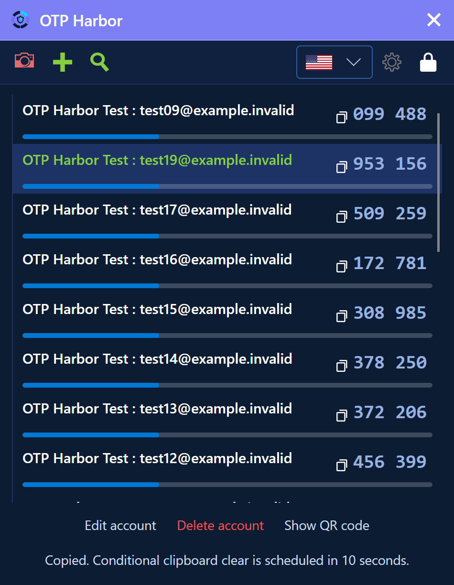

# OTP Harbor

**The local-first authenticator for desktop and Android.**

[](https://github.com/Legends/otp-harbor)
[](https://dotnet.microsoft.com/download/dotnet/10.0)
[](https://github.com/Legends/otp-harbor/actions/workflows/build-and-test.yml)
[](https://github.com/Legends/otp-harbor/actions/workflows/security-audit.yml)
[](https://apps.microsoft.com/detail/9P31KH5L924P)
[](LICENSE.txt)

**OTP Harbor** is an open-source, local-first TOTP and 2FA authenticator for Windows, macOS, Linux, and Android. It protects OTP seeds in an encrypted local vault and supports QR workflows, platform quick unlock, and encrypted backup and restore without requiring a cloud account.

> **Release status:** OTP Harbor `2.0.17` is publicly available from the [Microsoft Store](https://apps.microsoft.com/detail/9P31KH5L924P) for Windows. `v2.0.0` remains in release-candidate testing for direct GitHub packages. Android release packaging is ready, but the first public APK remains gated on production-key registration and protected-environment setup; desktop GitHub packages remain unsigned platform previews and use the Ed25519-signed RC appcast. Use synthetic accounts and keep a tested encrypted backup while evaluating prereleases.

<p align="center">
  
</p>

## Features

- AES-256-GCM encrypted local vault with Argon2id password derivation
- Windows Hello and macOS quick unlock with master-password recovery
- Account creation, editing, search, deletion, QR import/export, and Google Authenticator bulk migration
- Automatic clipboard clearing and idle/session locking
- Encrypted `.totp` backup, restore, and conflict handling
- English, German, French, and Spanish UI
- Native Avalonia desktop application for Windows, macOS, and Linux
- Focused Android app with biometric quick unlock, camera-based QR import, swipe actions, and the
  same encrypted backup format as desktop

Accounts use the common TOTP profile by default: SHA-1, six digits, and a 30-second code period. The period can be adjusted between 5 and 3600 seconds under **Advanced options** when adding or editing an account, if the provider requires a value other than 30 seconds. For example, a 10-minute period is entered as 600 seconds.

On desktop, right-click any existing account to open its contextual actions: **Edit account**, **Show QR code**, or **Delete account**. Deletion still requires confirmation.

### Import from Google Authenticator

OTP Harbor recognizes both normal `otpauth://` account QR codes and Google Authenticator transfer QR codes. For a desktop migration, start **Transfer accounts** / **Export accounts** in Google Authenticator, capture each generated QR code as a crisp screenshot, and choose each saved image in **Settings > Import / Export > Import from Google Authenticator**. OTP Harbor shows the number of detected accounts and asks for confirmation before changing the vault; multi-part exports prompt you to choose the next QR image. Android can scan the transfer QR codes directly with its camera workflow.

Treat migration QR codes as secrets: anyone who captures one can recreate the exported accounts. After importing, verify several generated codes and create a fresh encrypted OTP Harbor backup.

## Desktop experience

<table>
  <tr>
    <td></td>
    <td></td>
  </tr>
  <tr>
    <td align="center"><strong>Edit accounts without exposing stored secrets</strong></td>
    <td align="center"><strong>Configure quick unlock and recovery</strong></td>
  </tr>
  <tr>
    <td></td>
    <td></td>
  </tr>
  <tr>
    <td align="center"><strong>Export an account via QR code</strong></td>
    <td align="center"><strong>Unlock quickly with a recovery path</strong></td>
  </tr>
</table>

The QR screenshot is intentionally sanitized and contains only a published synthetic test secret. Never use it for a real account.

### Keyboard shortcuts

| Action | Shortcut |
| --- | --- |
| Search accounts | <kbd>Ctrl</kbd> + <kbd>F</kbd> |
| Add an account | <kbd>Ctrl</kbd> + <kbd>A</kbd> |
| Edit the selected account | <kbd>Ctrl</kbd> + <kbd>E</kbd> |
| Delete the selected account after confirmation | <kbd>Ctrl</kbd> + <kbd>D</kbd> or <kbd>Delete</kbd> |
| Lock the vault | <kbd>Ctrl</kbd> + <kbd>L</kbd> |
| Close the active search, editor, settings view, or QR preview | <kbd>Esc</kbd> |

## Distribution

**[Microsoft Store](https://apps.microsoft.com/detail/9P31KH5L924P) is the primary Windows distribution channel** (Store ID `9P31KH5L924P`). Microsoft signs the published MSIX and manages Store updates.

[GitHub Releases](https://github.com/Legends/otp-harbor/releases) remains the secondary channel for source-oriented users and explicit previews. GitHub direct packages use an Ed25519-signed appcast; Microsoft Store packages rely only on Store-managed updates.

| Platform | Package type |
| --- | --- |
| Windows 10/11 x64 | Public Microsoft Store MSIX; unsigned GitHub RC ZIPs with a signed application update feed; optional unsigned system-wide MSI with a branded setup flow, desktop and Start-menu shortcuts, administrator approval, and manual MSI upgrades |
| Ubuntu 24.04 x64 | DEB or self-contained tarball |
| macOS ARM64 | Structural artifacts are built in CI; production distribution still requires signing and notarization |
| Android 9 or newer | Planned production-signed universal APK from the matching GitHub Release; first publication is gated on signing-key registration |

After launch, create a master password and add an account manually, scan an `otpauth://` QR code, or import each saved QR image from a Google Authenticator bulk export in sequence. Treat QR images, OTPs, seeds, exports, and backups as secrets.

Maintainers can follow the [Microsoft Store release guide](docs/release/MICROSOFT_STORE.md) and [Android release guide](docs/release/ANDROID.md). The unsigned MSIX produced by the repository is exclusively a Partner Center submission input and must never be sideloaded or attached to a GitHub Release.

The optional GitHub RC MSI shows a completion message and lets the user choose whether to launch OTP Harbor. It installs for all users and creates desktop and Start-menu shortcuts. Because this preview MSI is not Authenticode-signed, Windows can show an unknown-publisher warning and may scan the first launch; verify its published SHA-256 checksum before installation.

## Security and recovery

The master password is the portable recovery path. Quick unlock is a convenience and never replaces it. Keep an external encrypted export and test restoration periodically.

- [Security policy](SECURITY.md)
- [Threat model](docs/security/THREAT_MODEL.md)
- [Security verification](docs/security/SECURITY_VERIFICATION.md)
- [Recovery guide](docs/RECOVERY.md)
- [Privacy policy](PRIVACY.md)

Report vulnerabilities privately as described in [SECURITY.md](SECURITY.md). Never attach real secrets, vaults, backups, or unreviewed logs.

## Code signing policy

**Windows code-signing status:** The previous SignPath Foundation application was not approved at this stage. A future reapplication may be considered after the project has established broader public adoption and independent trust signals. Current GitHub preview builds are unsigned. The public Microsoft Store package is the primary Windows channel and is signed through the Store certification process.

The Store and optional future direct-download trust models are defined in the [code signing policy](CODE_SIGNING_POLICY.md). Data handling is described in the [OTP Harbor privacy policy](PRIVACY.md).

## Build

Install the .NET 10 SDK, then run:

```powershell
git clone https://github.com/Legends/otp-harbor.git
cd otp-harbor
dotnet restore TOTP.sln --configfile NuGet.config
dotnet build TOTP.sln -c Debug
dotnet test TOTP.sln -c Debug
dotnet run --project .\TOTP.UI.Avalonia.Desktop\TOTP.UI.Avalonia.Desktop.csproj
```

### Keep a source build current

Users who intentionally run OTP Harbor from source can use the repository launcher:

```powershell
.\Start-OTP-Harbor.ps1
```

The launcher checks the official `origin/master` branch on every invocation. When a newer commit exists, it applies only a fast-forward update, restores dependencies, compiles the desktop app in Release mode, and starts it. When the source revision and the launcher's verified build are already current, it starts that build without compiling again. Git and the .NET 10 SDK are required.

For safety, the launcher refuses to update a modified, ahead, or diverged checkout and never discards local files. It is a convenience for source users, not a signed binary update channel; Microsoft Store installations should use Store updates, while official direct packages use the signed appcast.

The Android host remains in the dedicated [Android solution](TOTP.Android.sln), so desktop-only development does not require the Android workload. Tagged releases still publish its separately signed APK alongside the desktop artifacts. See the [Android development guide](docs/android/FOUNDATION.md) for its implemented scope, security notes, and build commands.

See [CONTRIBUTING.md](CONTRIBUTING.md) for engineering rules and [docs/README.md](docs/README.md) for the maintained documentation map.

## License

OTP Harbor is distributed under [MIT](LICENSE.txt). Third-party notices are in [THIRD_PARTY_NOTICES.md](THIRD_PARTY_NOTICES.md).
